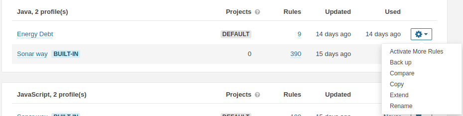
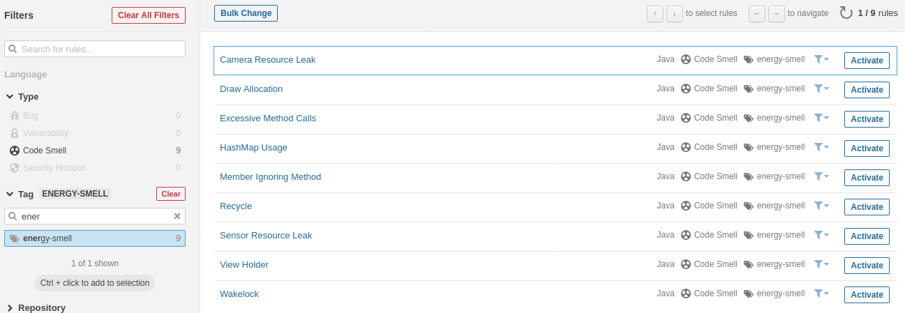

# Energy Debt Rules for Java Plugin

This guide instructs on the installation and usage of Energy Debt in SonarQube 8.x

## Installation

Installing the plugin is as simple as building it using `maven clean install` and copying the `energy-debt-rules-1.0-SNAPSHOT.jar` file in the resulting `target` folder, then moving it to your SonarQube's `$SONAR_HOME/extensions/plugins/` folder and (re)starting SonarQube.

## Usage

Once installed, you will need to activate the Energy Debt rules in your Java Quality Profile (if using the default Sonar Way profile, you will need to extend it into a new profile) through an administrative account. Due to the current state of the plugin, it is recommended that a separate profile is made for these rules due to its cost currently being displayed through the built in Debt measure.

This will bring up the list of Java rules which can be activated. You can easily find the Energy Debt Rules by filtering the `energy-smell` tag. Once found, all rules can be activated by selecting `Bulk Change` and choosing `Activate In [Quality Profile name]`.

Once this is complete, executing a Java code analysis will yield its Energy Debt, visible by accessing the project page, and looking at Maintainability, where it'll be displayed as a value of miliJoules per minute.
